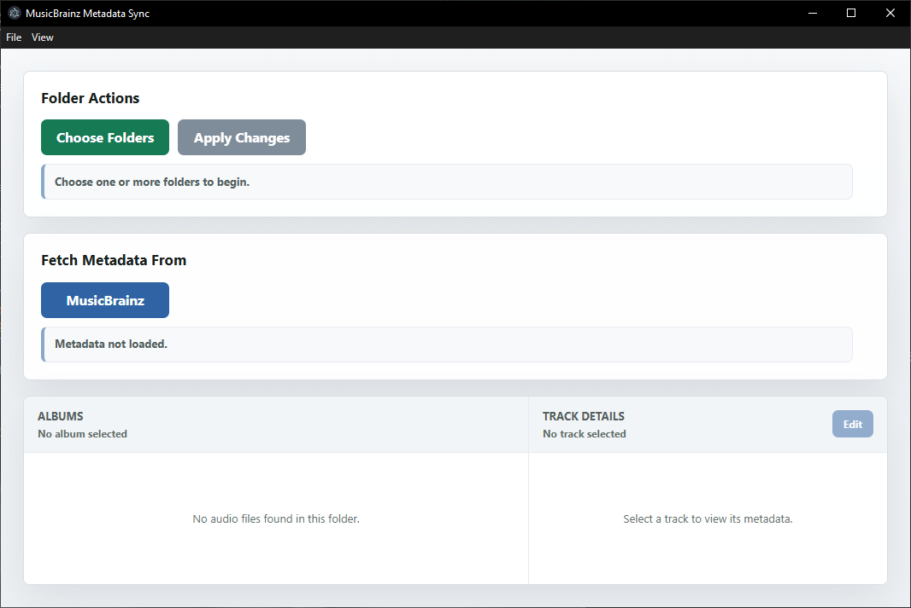

# MusicBrainz Metadata Sync

MusicBrainz Metadata Sync is a Windows desktop app for matching local music
files with MusicBrainz release metadata. It lets you preview the proposed
metadata, filenames, folder name, and artwork before changing the files.

## Preview



## Features

- Choose one or more album folders or parent folders containing multiple album folders.
- Read existing audio metadata with `ffprobe`.
- Sort files by disc and track number.
- Fetch MusicBrainz release metadata from artist and album search.
- Fetch MusicBrainz Cover Art Archive artwork.
- Preview fetched title, album, artist, album artist, disc, and track data.
- Preview the target folder name from fetched metadata.
- Apply folder cleanup by renaming each album folder and moving nested audio files into that album folder root.
- Save 1200px album artwork as `cover.jpg`, embed it in FLAC files, and save original artwork as `original.jpg`.
- Remove non-audio sidecar files and empty folders from the album folder after applying changes.

The app previews fetched metadata before applying folder and FLAC tag changes.

## Requirements

- Windows 10 or Windows 11
- FFmpeg tools:
  - `ffprobe` reads existing audio metadata.
  - `ffmpeg` reads embedded artwork.
- FLAC tools:
  - `metaflac` replaces FLAC metadata and embedded artwork.
- An internet connection for MusicBrainz metadata and Cover Art Archive artwork.
- Node.js and npm only when running or building the app from source.

No MusicBrainz API key is required.

## Install Required Audio Tools on Windows

The app starts `ffprobe`, `ffmpeg`, and `metaflac` by name, so their executable
files must be available on the Windows `PATH`. Installing the app does not
install these tools automatically.

- Download FFmpeg and `ffprobe` from the
  [FFmpeg Windows builds page](https://www.gyan.dev/ffmpeg/builds/). Download
  and extract a release ZIP containing `ffmpeg.exe` and `ffprobe.exe`.
- Download `metaflac` from the
  [official FLAC download page](https://xiph.org/flac/download.html). Download
  and extract the FLAC for Windows ZIP.
- Add the folders containing `ffmpeg.exe`, `ffprobe.exe`, and `metaflac.exe`
  to the Windows user `PATH`.
- Close and reopen PowerShell and the app after changing `PATH`.

Verify that Windows can find the tools:

```powershell
ffprobe -version
ffmpeg -version
metaflac --version
```

Each command should print version information. If a command is not recognized,
check that its executable folder was added to `PATH`, then open a new
PowerShell window and try again.

## Run a Packaged App

After installing MusicBrainz Metadata Sync or downloading its portable
executable:

1. Install and verify `ffprobe`, `ffmpeg`, and `metaflac` using the steps
   above.
2. Start MusicBrainz Metadata Sync.
3. Follow the workflow below.

Node.js and npm are not required for a packaged installer or portable build.

## Development Setup

### 1. Install Node.js

Download and install the current Node.js LTS release from
[nodejs.org](https://nodejs.org/). npm is included with Node.js.

Open a new PowerShell window and verify the installation:

```powershell
node --version
npm --version
```

### 2. Install the audio tools

Install and verify `ffprobe`, `ffmpeg`, and `metaflac` as described in
[Install Required Audio Tools on Windows](#install-required-audio-tools-on-windows).

### 3. Install project dependencies

Clone or download this repository, open PowerShell in the project folder, and
run:

```powershell
npm.cmd install
```

## Run

Start the app:

```powershell
npm.cmd start
```

Start it with automatic restart when source files change:

```powershell
npm.cmd run dev
```

## Build Windows Installer

Create the Windows installer:

```powershell
npm.cmd run build:win
```

The installer is written to `dist/`. Installed copies still require
`ffprobe`, `ffmpeg`, and `metaflac` to be available on `PATH`.

## Build Portable Windows App

Create a portable executable that runs without installation:

```powershell
npm.cmd run build:portable
```

The portable executable is written to `dist/`. It still requires `ffprobe`,
`ffmpeg`, and `metaflac` to be available on `PATH`.

## Workflow

1. Start the app.
2. Choose one or more album folders or parent folders containing multiple album folders.
3. Confirm or edit the Artist and Album fields.
4. Click **MusicBrainz**.
5. Review the preview table, target folder name, and artwork.
6. Click **Apply Changes** only when the preview looks correct.

## What Apply Changes Does

Applying changes can:

- Rename the album folder using the fetched metadata.
- Move nested audio files into the album folder root.
- Rename tracks using their track number and title.
- Replace tags and embedded artwork in FLAC files.
- Save resized artwork as `cover.jpg` and original artwork as `original.jpg`.
- Remove non-audio sidecar files and empty nested folders.

Because these operations modify files and folders, test the workflow on a
copy of an album first and always review the preview before applying changes.

## Troubleshooting

### Metadata or embedded artwork is missing

Run `ffprobe -version` and `ffmpeg -version` in a new PowerShell window. If
either command fails, correct its `PATH` entry and restart the app.

### Applying FLAC tags or artwork fails

Run `metaflac --version`. If the command fails, correct the FLAC tools `PATH`
entry and restart the app.

Only FLAC files have their tags and embedded artwork replaced. The app can
scan other supported formats, but it does not rewrite their tags.

### The command works in PowerShell but not in the app

Completely close and reopen the app after changing `PATH`. If it was launched
from a terminal, close that terminal too, open a new one, and start the app
again.

### MusicBrainz or artwork requests fail

Check the internet connection and retry. MusicBrainz and the Cover Art Archive
are public services, so requests can occasionally be rate-limited or
temporarily unavailable.

## Project Structure

```text
src/
  main.js                 Electron window and IPC setup
  preload.js              Safe bridge between renderer and main process
  main/
    audio.js              ffprobe metadata reading and file sorting
    folderWorkflow.js     folder rename and audio flatten workflow
    musicbrainz.js        MusicBrainz release lookup and metadata fetch
  renderer/
    index.html            UI markup
    renderer.js           UI behavior and preview rendering
    styles.css            UI styling
```
